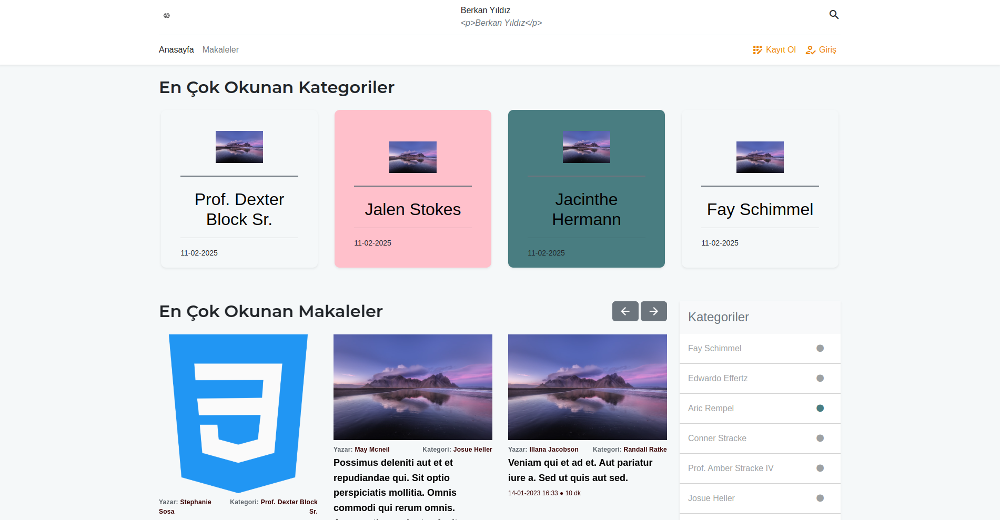
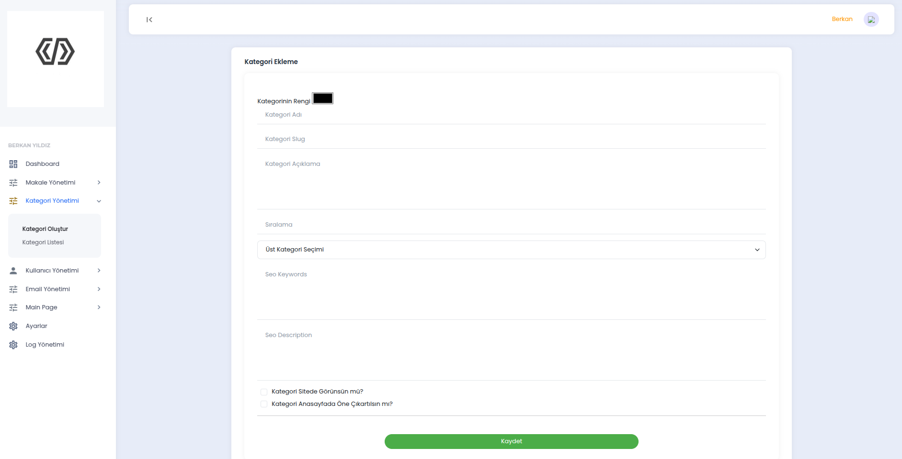
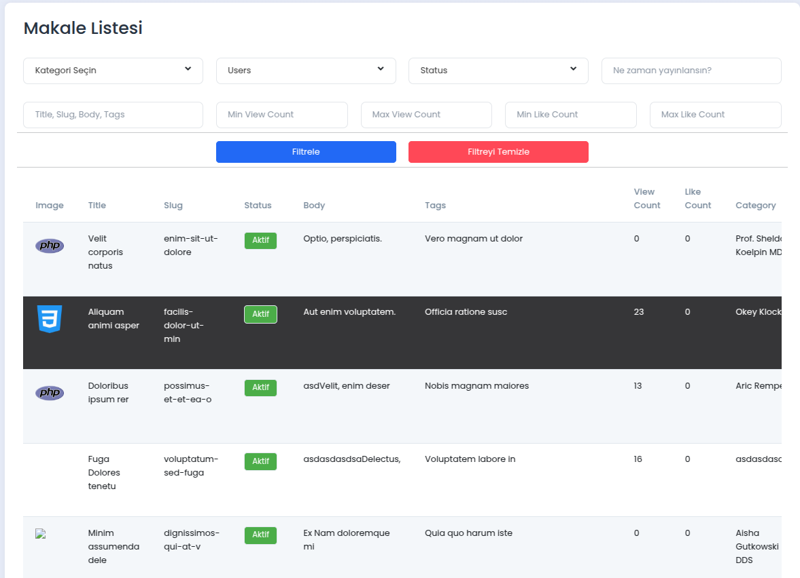
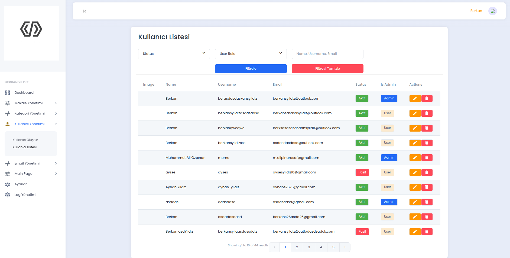

# Laravel Makale Yayınlama Projesi

Bu proje, Laravel framework'ü kullanarak geliştirilen ve makale yayınlama platformu sunan bir uygulamadır. Kullanıcılar, makale ekleyebilir, makalelere yorum yapabilir ve yorumlara çocuk yorumlar ekleyebilir. Ayrıca admin paneli üzerinden makale, kategori, kullanıcı, yorumlar ve site ayarları yönetilebilir. Proje, tüm işlemleri loglayarak yönetimsel verilerin takibini kolaylaştırmaktadır.

## Özellikler

### 1. **Ana Sayfa**
Ana sayfada aşağıdaki bölümler bulunmaktadır:
- **En Çok Okunan Makaleler:** Kullanıcıların ilgisini çeken ve popüler hale gelen makaleler.
- **Son Yüklenen Makaleler:** Yeni eklenen makaleler.
- **Kategoriler:** Kullanıcıların makale içeriklerini kolayca filtreleyebileceği kategori listesi.

#### Örnek Ana Sayfa:

### 2. **Kategori ve Makale Detayı**
Her kategoriye ait detaylı sayfa bulunmaktadır. Kategoriler altında listelenen makalelere tıklayarak, her bir makale hakkında daha fazla bilgi edinebilir, yorum yapabilir ve çocuk yorumlar bırakabilirsiniz.

#### Kategori Sayfası:

#### Makalelerin Hepsinin Bulunduğu Sayfa:

#### Makale Detay Sayfası:

#### Örnek Hata Mesajı:

### 3. **Yorum ve Çocuk Yorumlar**
Kullanıcılar, makalelere yorum bırakabilir ve her bir yoruma çocuk yorumlar ekleyebilir. Bu özellik, daha detaylı etkileşimler ve tartışmaların yapılmasına olanak tanır.

#### Yorumlar:

### 4. **Kullanıcı Kayıt ve E-posta Doğrulama**
Kullanıcılar, siteye üye olduklarında, e-posta adreslerine doğrulama maili gönderilir. E-posta doğrulama işlemi başarıyla tamamlandığında, kullanıcı aktif hale gelir. Ayrıca, "Şifremi Unuttum" özelliğiyle kullanıcılar şifrelerini sıfırlayabilirler.

#### E-posta Doğrulama: Admin Tarafından Custom Logolu Tema eklenebiliyor.

#### Parolamı Unuttum:

### 5. **Admin Paneli**
Admin paneli, site yöneticilerinin kategorileri, makaleleri, kullanıcıları ve yorumları yönetmesine olanak tanır. Adminler ayrıca her işlem için durum değiştirme (aktif/pasif) işlemlerini gerçekleştirebilir ve tüm işlemlerin loglarını görüntüleyebilir.

#### Admin Paneli:

#### Admin Paneli - Kategori Yönetimi:

#### Admin Paneli - Makale Yönetimi:

#### Admin Paneli - Kullanıcı Yönetimi:

### 6. **E-posta ve Tema Yönetimi**
Admin panelinde, e-posta teması seçimi ve yeni tema oluşturma gibi özellikler bulunmaktadır. Bu sayede site içindeki tüm e-posta bildirimleri ve görsel temalar özelleştirilebilir.

#### Tema Seçimi:

### 7. **İşlem Günlükleri (Logs)**
Proje, tüm yönetimsel işlemleri kaydeder. Adminler yapılan işlemleri günlüklere bakarak takip edebilirler. Bu loglar, güvenlik ve izleme açısından önemlidir.

#### Loglar:

### 8. **Listeleme ve Filtreleme**
Projede, tüm listeleme sayfalarında filtreleme yapılabilir. Kategoriler veya makaleler, kullanıcıların belirlediği kriterlere göre listelenebilir. Bu özellik, kullanıcıların aradıkları içeriği kolayca bulmalarını sağlar.

#### Filtreleme Özelliği:

### 9. **Site İçin Basit Ayar Ekranı**
Admin panelinde, site içi temel ayarların yapılabildiği bir ekran yer almaktadır. Bu ekran, siteyi özelleştirmek ve yönetmek için gerekli temel ayarları yapmanızı sağlar.

#### Site Ayarları:

### Gereksinimler
- PHP 8.0 veya üstü
- Composer
- Laravel 8.x veya üstü
- MySQL veya benzeri bir veritabanı

# MakaleYayinlamaLaravel
# MakaleYayinlamaLaravel
# MakaleYayinlamaLaravel
# MakaleYayinlamaLaravel
# MakaleYayinlamaLaravel
# MakaleYayinlamaLaravel
# makaleYayinlamaLaravel
